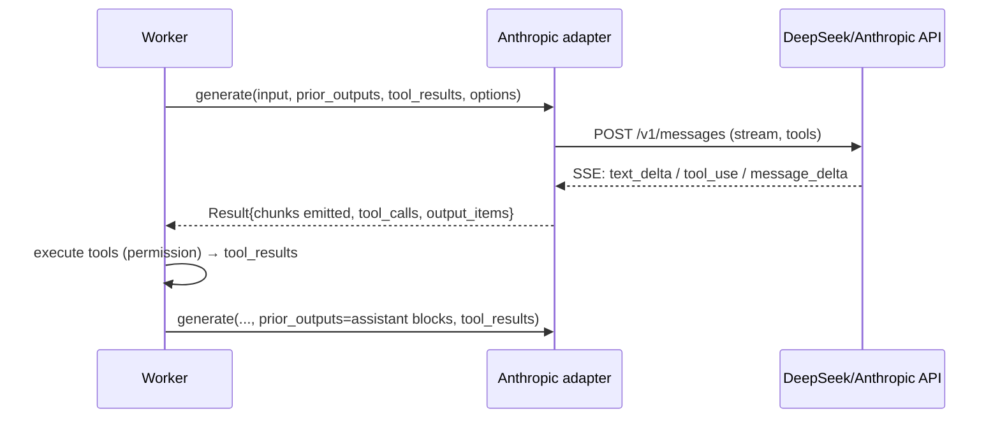

# Plan: Anthropic adapter (Epic 2 F2)

## Scope

Implement the `api: "anthropic"` adapter — the Anthropic Messages API
(`POST {url}/v1/messages`) — and wire the worker's per-api dispatch so
providers configured with `api: "anthropic"` (Anthropic-native or
DeepSeek's `/anthropic` Anthropic-compatible endpoint) actually work.

**In scope:**
- `util/http.zig`: generalize auth (`Authorization: Bearer` for openai vs
  `x-api-key` + `anthropic-version` for anthropic) + extra headers
- `provider/anthropic.zig`: the adapter behind the existing `Options` shape
  (base_url, api_key, config KVs, tools, emit, is_cancelled):
  - Request: `{model, max_tokens (required — config KV `max_tokens` or
    default 1024), system? (config KV), messages (translated from the
    worker's input items + prior assistant blocks + tool_result user
    messages), tools (flat `{name, description, input_schema}` from the
    registry), stream: true}`
  - SSE parse: `text_delta` → emit chunks; `tool_use` content blocks →
    `Result.tool_calls {id, name, arguments}` (arguments accumulated from
    `input_json_delta` partials); `message_delta` stop_reason →
    end_turn/tool_use/max_tokens; usage from message_start/message_delta;
    `thinking` deltas skipped for display but the assistant content blocks
    echoed via `output_items` for tool continuation
  - Multi-turn continuation: prior_outputs (assistant blocks) + tool_results
    → assistant message + user message with `tool_result` blocks
- Worker dispatch: `Context.adapters: [2]?adapter.Provider` indexed by
  `ApiKind` (replaces the single `ctx.provider`); server.run wires openai +
  anthropic; tests inject fakes per slot; unknown api → AdapterNotImplemented
- Tests: anthropic SSE parse (text + tool_use + thinking skip), request build
  (messages/tools/max_tokens/system), worker dispatch with a fake anthropic
  provider, mock HTTP round-trip
- Live smoke against DeepSeek's `/anthropic` endpoint

**Out of scope (this feature):** multi-provider per-session selection (v2
providers/*), streaming tool-call input deltas across SSE events beyond
accumulation, image content.

## Architecture

```
provider/anthropic.zig
  generate(allocator, input, prior_outputs, tool_results, options) !Result
    buildRequest: translate input items → messages; append prior_outputs as
      an assistant message; append tool_results as tool_result user message;
      model/max_tokens/system from options.config KVs; tools from registry
    parseStream: SSE events → text chunks (emit), tool_use blocks →
      tool_calls, stop reason, usage; output_items = assistant content blocks

methods.zig worker:
  ctx.adapters[@intFromEnum(provider.api)] → the generate fn (openai or
    anthropic); resolves model + config KVs as today
```



## Units of Work

1. **http_util auth generalization** — `Auth` enum (bearer | x_api_key) +
   extra headers on `request`
   - *Checkpoint:* existing openai/mock/health-check tests still pass with
     the new signature
2. **anthropic.zig: request build + SSE parse** — messages translation, flat
   tools, max_tokens/system defaults, event handling
   - *Checkpoint:* unit tests — SSE stream with text + tool_use + thinking →
     chunks/tool_calls/output_items; request body exact JSON; tool_result
     continuation shape
3. **Worker dispatch** — `Context.adapters[ApiKind]`; server.run wires both;
   anthropic provider no longer AdapterNotImplemented
   - *Checkpoint:* transcript test with a fake anthropic provider (tool call
     → execute → continuation)
4. **Mock round-trip + live smoke** — mock `/v1/messages`; live DeepSeek
   `/anthropic` prompt + tool call
   - *Checkpoint:* mock test; live smoke (basic + get_current_time)
5. **Conformance + commit**

## Verification Strategy

- **Data:** request body exact JSON (messages roles/order, flat tools,
  max_tokens, system); SSE parse edge cases (ping, thinking skip, partial
  input_json accumulation)
- **Function:** messages translation from Responses-style input items;
  tool_use → ToolCall; stop reasons (end_turn/tool_use/max_tokens); usage
- **Context:** continuation echoes assistant blocks + tool_result messages;
  worker dispatch per api; per-session model/config KVs flow through
- **API:** transcript with fake anthropic provider; mock HTTP round-trip;
  live DeepSeek `/anthropic` smoke (basic + tool call)

## Integration Contract (Anthropic Messages API, verified live 2025-08-11)

- `POST {url}/v1/messages`; headers `x-api-key` + `anthropic-version:
  2023-06-01`; `max_tokens` required; `messages` roles user/assistant;
  `tools` flat `{name, description, input_schema}`
- SSE: `content_block_start/delta/stop`, `message_delta` (stop_reason),
  `message_stop`, `ping`; deltas `text_delta` / `input_json_delta` /
  `thinking_delta`
- Tool continuation: assistant message (tool_use blocks) + user message
  (`tool_result {tool_use_id, content}`)
- DeepSeek: `https://api.deepseek.com/anthropic` + `/v1/messages`; emits
  `thinking` blocks; models deepseek-v4-flash (v4-pro unavailable)
- Config: `{api: "anthropic", url: "https://api.deepseek.com/anthropic" |
  "https://api.anthropic.com", api_key_env: ..., model: ...}`

## References

- `.ai/knowledge/references/acp-schema-v1.json` — ACP types (unchanged;
  the adapter maps to the existing Options/Result surface)
- Anthropic Messages API (probed live via DeepSeek's /anthropic endpoint)
- `~/Downloads/fossil-linux-x64-2.28/fossil-agent.tcl` — client consumption
  (session/update agent_message_chunk unchanged)

## Status

- **Stage:** 2 (Implementation)
- **Current unit:** 5 (Conformance)
- **Last checkpoint:** Units 1–4 done — http auth, anthropic adapter (request/SSE/tool_use/continuation), per-ApiKind worker dispatch, mock round-trip; 55/55 tests; live DeepSeek /anthropic smoke (basic + tool call) verified
- **Next action:** commit, then review

---

## Outcomes

### What was implemented
- provider/anthropic.zig — Messages API adapter (x-api-key auth, flat tools,
  max_tokens, SSE text/tool_use/thinking handling, usage merge, continuation)
- http_util auth generalization (bearer | x_api_key + extra headers)
- Worker per-ApiKind dispatch (Context.adapters); health check skips
  anthropic
- Both API dialects served: openai (Responses) + anthropic (Messages)

### Changes from the original plan
- None material; health check had to skip anthropic (no models endpoint) —
  discovered during the live smoke

### Use cases resolved
- Providers with `api: "anthropic"` work (Anthropic-native or DeepSeek
  /anthropic) ✓
- Tool calls round-trip through the anthropic adapter ✓
- Session model/config KVs (max_tokens, system, model) flow through ✓
- Multi-provider config serves both dialects from one registry ✓

### Verification results
- All checkpoints passed: yes
- 55/55 tests; fmt clean; smoke OK; cross-compile OK
- Live: DeepSeek /anthropic basic + tool-call round-trip verified

### Knowledge updates
- decisions.md: Epic 2 F2 entry (adapter, auth, dispatch, health-check skip)
- README: multi-provider config example covers both apis

## Status
- **Stage:** 3 (Review) — see Status above for the implementation checkpoint
