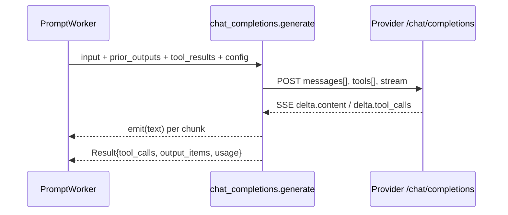

# Plan: Chat Completions adapter

**Branch:** `feature/chat-completions-adapter`
**Created:** 2026-10-04
**Backlog:** `.ai/backlog/3.md` — `feature/chat-completions-adapter`
**Depends on:** existing adapter interface (`src/provider/adapter.zig`)

## Scope

Add a third provider dialect: OpenAI **Chat Completions**
(`POST {base}/chat/completions`, SSE), for OpenAI-compatible providers that
predate the Responses API. Selected via config `"api": "chat_completions"`.

## Architecture

- **File:** `src/provider/chat_completions.zig`, exposing `generate` with the
  shared `adapter.Provider` signature.
- **Input translation:** the worker builds Responses-style input items
  (`{type:"message", role, content:[{type:"input_text"|"output_text", text}]}`).
  The adapter flattens them to Chat messages (`{role, content}`), prepends an
  optional `system` message, appends prior assistant turns (Chat-shaped
  `output_items` produced by `parseStream`), then `{role:"tool", tool_call_id,
  content}` for tool results.
- **Tools:** standard nested `{type:"function", function:{name, description,
  parameters}}`; `tool_choice:"auto"`. Omitted when the surface is empty.
- **Streaming:** SSE `data:` frames; `choices[0].delta.content` → `emit`;
  `delta.tool_calls` fragments accumulate by `index`; `finish_reason` and the
  final `usage` (via `stream_options.include_usage`) drive the `Result`.
- **Continuation:** `output_items` carries the assistant message with
  `tool_calls` so the worker can echo it alongside tool results on the next
  call.
- **Dispatch:** `ApiKind` gains `chat_completions` (index 2); `Context.adapters`
  and `server.run` widen from `[2]` to `[3]`; `main.zig` registers the adapter.

### Data flow

## Units of Work

1. **Adapter** — `src/provider/chat_completions.zig`: `generate`, `buildBody`,
   `parseStream`, `extractUsage`, `appendChatMessage`. *verified by 4 unit tests.*
2. **Registration** — `ApiKind.chat_completions` + parse; `[2]→[3]` adapter
   arrays (`methods.Context`, `server.run`, test call sites); `root.zig` export;
   `main.zig` wiring. *verified by config parse test + build.*
3. **Docs** — README dialect list/table/config, `examples/config.example.json`.
4. **Knowledge** — decision register.

## Verification Strategy

- `zig build test`: existing suite + 4 new adapter tests
  (`parseStream` content, `parseStream` streamed tool calls, `buildBody`,
  full mock `/chat/completions` round-trip) + config parse coverage.
- `zig fmt --check .`, `zig build`.
- Mock HTTP server confirms the request is `POST /chat/completions` with
  Bearer auth.

## Status

- **Stage:** Implementation — complete
- **Current unit:** U1–U4
- **Next action:** verify + commit + merge
