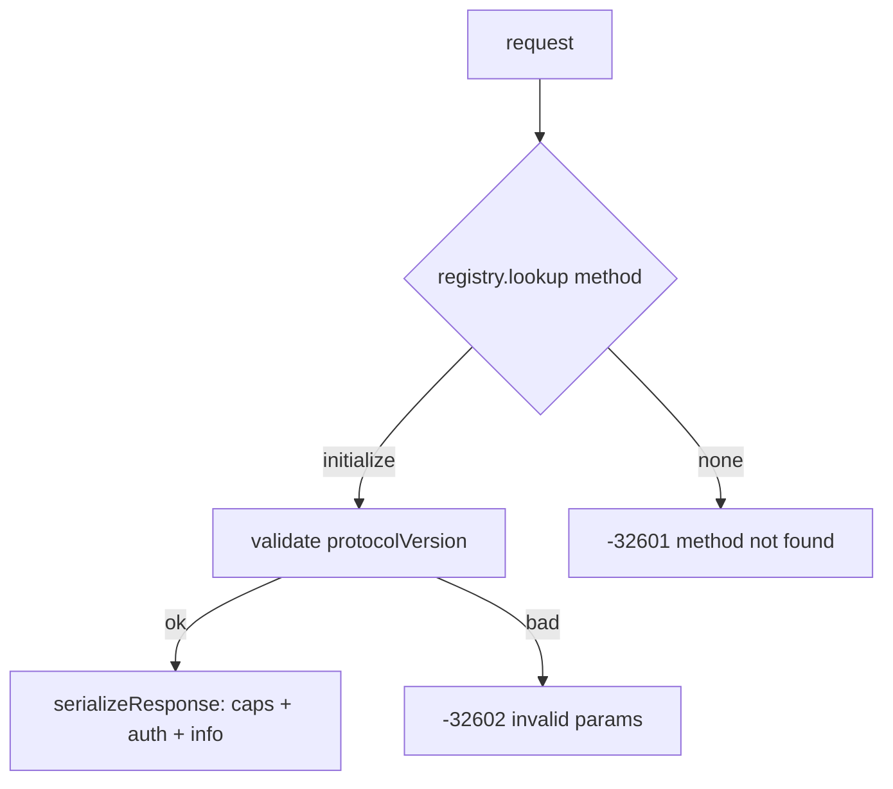

# Plan: initialize handshake + version-namespaced protocol layer (F2)

## Scope

Implement the `initialize` method per ACP v1 and restructure the protocol
layer into version namespaces (`protocol/v1/`, `protocol/v2/`), with a
version-keyed method registry. After this feature, a real client (e.g. the
fossil ACP client) can complete the handshake and receive an honest
capability advertisement.

**In scope:**
- `protocol/v1/` namespace: method registry + `initialize` handler
- `protocol/v2/` namespace: empty placeholder (may `@import` v1 later)
- server.zig dispatch through the registry (unknown methods still -32601)
- Error mapping: handler errors → JSON-RPC codes
- Terminological correction: ACP v1/v2 are **session-oriented** (`session/new`
  → `session/prompt` → `session/update` stream → `PromptResponse`); no
  Thread/Turn types — fix glossary/README/backlog references

**Out of scope (this feature):** session methods (`session/new`,
`session/prompt`, `session/cancel`, … — F3), notifications (`session/update` —
F3), state/context struct, v2 registry content.

## Architecture

### Data layer

```
protocol/
├── json_rpc.zig     # shared: wire format, Message, RequestId (unchanged)
├── v1/
│   ├── methods.zig  # v1 method registry + handlers (initialize now)
│   └── types.zig    # v1 ACP types (SessionId, PromptRequest, SessionUpdate,
│                    #   ToolCall, … — populated in F3)
└── v2/              # later: v2 registry/types; may @import v1 for shared
                     #   behavior ("2 can ref 1")
```

- `Handler = fn (allocator: Allocator, params: std.json.Value) Error!std.json.Value`
- `Registry` — comptime version-keyed table: `method name → Handler`
- v1 initialize response (schema `InitializeResponse`):
  - `protocolVersion: 1`
  - `agentCapabilities` — **MVP surface** (user decision):
    `{ "sessionCapabilities": {}, "promptCapabilities": {} }`
    (baseline session methods + text-only prompts)
  - `authMethods: []`
  - `agentInfo: { "name": "agent-client-protocol", "version": "0.1.0" }`

### Function layer

- `initialize(allocator, params)`:
  - `protocolVersion` must be an integer ≥ 1 → else `error.InvalidParams`
  - `clientCapabilities` / `clientInfo` accepted and ignored for now (logged)
  - returns the response object above
- Registry dispatch: lookup by method name; miss → caller answers -32601
- Error mapping: `error.InvalidParams → -32602`, `error.InvalidRequest → -32600`,
  anything else → `-32603`

### Context layer

- initialize is stateless — no context struct yet. The registry instance lives
  for the process; the version-negotiation seam (which registry serves a
  connection) is documented and wired when F3 introduces session state.

### API / Contract

```
server.zig dispatch:
  request  → registry.lookup(method) → handler(allocator, params)
             → serializeResponse(id, result) | error mapping
  unknown method → -32601 (preserved from F1)
```



## Units of Work

1. **Namespace restructure** — create `protocol/v1/methods.zig`,
   `protocol/v1/types.zig`, `protocol/v2/` placeholder; remove the
   `protocol/methods.zig` / `protocol/types.zig` stubs; update `root.zig`
   exports and `server.zig` imports
   - *Checkpoint:* `zig build test` still green (F1 tests unaffected)
2. **Registry** — `Registry` comptime table + `Handler` type + error mapping
   - *Checkpoint:* unit tests — lookup hit/miss, error → code mapping
3. **initialize handler** — validation + response shape
   - *Checkpoint:* unit tests — valid (≥1), missing/non-integer/zero
     protocolVersion, response JSON exact shape
4. **server.zig integration** — dispatch through registry
   - *Checkpoint:* transcript test — initialize answers; `session/new` still
     -32601; verbatim id through the handler path
5. **Terminology fix** — glossary/README/backlog: session-oriented model
   (session/prompt), remove Thread/Turn claims
   - *Checkpoint:* docs consistent with schema v1 meta.json method list
6. **Conformance** — fmt, full tests, fixture, commit

## Verification Strategy

- **Data:** initialize response exact JSON bytes (unit); protocolVersion
  boundaries (1, 0, -1, missing, 1.5, "1", null)
- **Function:** handler branches — valid, invalid version, missing params;
  registry hit/miss; error mapping table
- **Context:** stateless — repeated initializes identical; no leaks
  (testing allocator)
- **API:** transcript integration — real-client-shaped initialize exchange;
  unknown methods still -32601; notifications still ignored

## Integration Contract (fossil client, read-only)

- Sends: `{"protocolVersion": 1, "clientCapabilities": {}, "clientInfo":
  {name, title, version}}` (client `init` at fossil-agent.tcl ~line 1988)
- Stores `agentCapabilities` from the result; does **not** gate subsequent
  calls on it — calls `session/new` unconditionally on first prompt
- Expects `sessionId` from `session/new`, then `session/prompt` with
  `{sessionId, prompt: [{type: text, ...}]}` (F3)

## References

- `.ai/knowledge/references/acp-schema-v1.json` — `InitializeRequest`,
  `InitializeResponse`, `AgentCapabilities`, `PromptCapabilities`,
  `SessionCapabilities`, `Implementation`, `AuthMethod`
- `~/Downloads/fossil-linux-x64-2.28/fossil-agent.tcl` — client handshake

## Status

- **Stage:** 4 (Complete — merged to main as `2326f45`)
- **Current unit:** —
- **Last checkpoint:** Squash-merged, branch deleted; 26/26 tests, fmt clean
- **Next action:** None — task done in `.ai/backlog/1.md`

---

## Outcomes

### What was implemented
- `src/protocol/v1/methods.zig` — version-keyed comptime registry (`lookup`),
  `Handler` type, `initialize` handler, `protocol_version`/`agent_name`/
  `agent_version` consts
- `src/protocol/v2/methods.zig` — placeholder namespace (Epic 2 content)
- `src/protocol/v1/types.zig` — placeholder for F3 session types
- `src/server.zig` — dispatch through the v1 registry; handler errors mapped
  to JSON-RPC codes; unknown methods still -32601
- Terminology corrected to the session-oriented model across
  glossary/architecture/backlog (no Thread/Turn types in the schemas)

### Changes from the original plan
- None material — implementation matches the plan. Minor: the F1 transcript
  fixtures (Zig + shell) switched from `initialize`/`session/*` to
  `test/unknown*` methods, since those methods are now implemented

### Use cases resolved
- Client handshake completes: `initialize` → `{protocolVersion:1,
  agentCapabilities, authMethods, agentInfo}` with verbatim id ✓
- Client with `protocolVersion >= 1` (incl. future versions) negotiated down
  to 1 ✓
- Invalid/missing protocolVersion → -32602 ✓
- Unknown methods still -32601 (e.g. `session/new` until F3) ✓
- v1/v2 namespace seam in place — v2 can `@import` v1 (Epic 2) ✓

### Verification results
- All checkpoints passed: yes
- Full test suite: 26/26 passing; fmt clean; smoke fixture OK
- Benchmarks: n/a

### Knowledge updates
- glossary.md: session-oriented ACP model (Session/Prompt/SessionUpdate/
  PromptResponse), Thread/Turn removed; Zig 0.16 idioms already captured in F1
- architecture.md: session-oriented model + MVP method list corrected
- decisions.md: F2 entry (namespaced layout, registry, initialize contract,
  MVP-surface capabilities, terminology)
- backlog: F3 renamed `feature/session-prompt-lifecycle` (session lifecycle +
  prompt flow)
