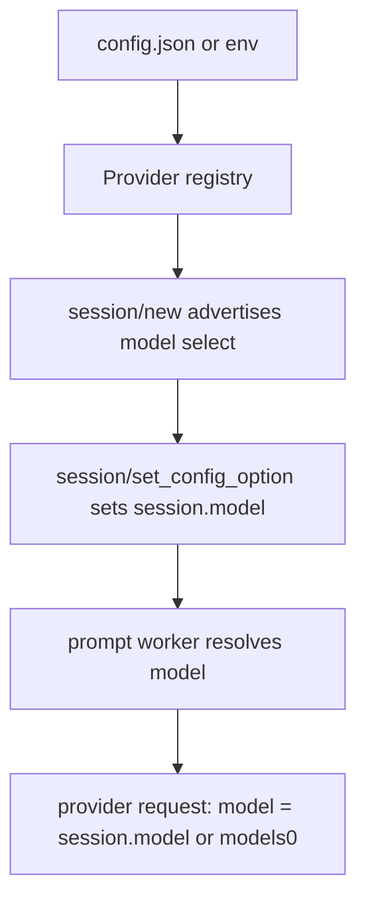

# Plan: multi-provider configuration + session model config (Epic 2)

## Scope

Replace the single implicit provider (flat env vars) with a **provider
registry** driven by a JSON config file, and add the ACP v1-native **session
model configuration** (`NewSessionResponse.configOptions` +
`session/set_config_option`). Providers self-describe: API dialect, endpoint,
key, and the list of models they serve. The first listed model is the default;
a session can switch models at runtime — the stable-v1 multi-LLM mechanism.

**In scope:**
<!-- 2026-08-11T12:00: User amendment — drop the models list; a single model fallback + free session model selection -->
<!-- 2026-08-11T14:00: User amendment — default provider = first listed when default_provider absent -->
- JSON config file (`~/.config/agent-client-protocol/config.json`, overridable
  via `ACP_CONFIG`); `default_provider` is optional — **the first listed
  provider is the default** when absent:
  ```json
  {
    "default_provider": "deepseek",
    "providers": {
      "deepseek": {
        "api": "openai",
        "url": "https://api.deepseek.com/v1",
        "api_key_env": "DEEPSEEK_API_KEY",
        "model": "deepseek-v4-flash"
      }
    }
  }
  ```
  - ~~`models[]` required, ≥1 — the first is the default model~~ → a single
    **`model`** per provider = the **fallback** (default `deepseek-v4-flash`
    when absent). The API requires a model and errors on invalid (empirically
    verified — no fallback), so the provider always has one
  - **Session model config is free-form**: `session/set_config_option` accepts
    ANY model string — users are not locked to the advertised options, so
    newer models work without config updates; the advertised select just shows
    the current/fallback model
  - `api` discriminator → adapter: `openai` (existing Responses adapter);
    `anthropic` → clear "adapter not implemented" startup error until that
    adapter feature lands (then plugs in under the key)
  - Key: `api_key_env` (resolve from env) or inline `api_key`
- Provider registry: config → resolved providers (key resolved, defaults
  applied); the `Provider` adapter interface resolves per `api`
<!-- 2026-08-11T12:30: User amendment — arbitrary session KVs forwarded to the LLM config -->
- **Session config is a generic KV surface**: any `session/set_config_option` value is stored on the session and forwarded to the provider adapter, which applies the request fields it understands (`model`, `reasoning.effort`, `temperature`, `max_output_tokens`, `top_p`, …) and skips unknowns with a log. `model` is one of the KVs (worker resolves the fallback: session value or provider.model). No lock-down — newer knobs work without config changes.
- **Session model config** (ACP v1):
  - `session/new` response gains `configOptions`: a `model` select
    (SessionConfigSelect: options = [provider.model] (the fallback shown),
    currentValue = session model or provider.model)
  - `session/set_config_option {sessionId, configId: "model", value}`
    → sets the session's model; response returns the updated configOptions
  - The prompt worker resolves the model: session model if set, else
    provider.model; the provider request uses it. `session/set_config_option`
    accepts any model string (not validated against a list)
  - Invalid session-set models surface as clear provider errors at prompt time
- Adapter: **stop sending `reasoning.effort`** when unset (empirically
  verified: the API accepts unset and the model decides); effort is dropped
  from config entirely
- Backward compat: no config file → env vars define the default provider
  (`api: openai`, `models: [OPENAI_MODEL || deepseek-v4-flash]`,
  `OPENAI_URL`, `OPENAI_API_KEY`)
- Startup health check runs against the **default** provider only; others
  validate lazily on first use

**Out of scope (this feature):** Anthropic adapter implementation (separate
Epic 2 feature — this feature reserves the `api: "anthropic"` key and errors
cleanly), per-session provider switching (needs the v2 `providers/*`
stabilization — the registry is shaped for it), effort control (re-add as a
one-line change if wanted).

## Architecture

### Data layer

```
config.zig (extended)
  ProviderConfig { name, api: ApiKind, url, api_key: ?[]const u8 (resolved),
                   models: [][]const u8 }
  ApiKind = enum { openai, anthropic }
  Config { default_provider: []const u8, providers: []ProviderConfig }

Session + { model: ?[]const u8 }   // session-set model, else provider default
Context.config: config.Config      // replaces the flat Config
```

### Function layer

- `config.loadFile(path)` / `config.load(env)` — parse JSON (stdlib),
  validate (providers non-empty, each has api/url/models≥1, key resolvable);
  env-only fallback builds the single default provider
- `config.resolveProvider(name)` — look up + resolve key (api_key_env → env)
- `adapter.forApi(kind)` — dispatch: openai → `openai.generate`;
  anthropic → `error.AdapterNotImplemented`
- `sessionNew` — advertises `configOptions` with the model select
- `sessionSetConfigOption` — validate + set session.model, return
  `{configOptions}` (schema `SetSessionConfigOptionResponse`)
- Prompt worker — resolves model: `session.model orelse models[0]`, passes
  into the provider Options; provider request drops `reasoning.effort`

### Context layer

- Config + registry live for the process (arena); sessions hold their
  selected model (session arena)
- Provider resolution happens per session at `session/new` (the provider is
  fixed per session; model is session-configurable)

### API / Contract

```
session/new →
  { sessionId, configOptions: [{ id: "model", name: "Model",
      category: { kind: "model_selector" }, value: { type: "select",
      options: [...models], currentValue: <model> } }] }
session/set_config_option {sessionId, configId: "model", value: "..."} →
  { configOptions: [...] }
```



## Units of Work

1. **Config struct + JSON parse + validation** — `config.zig` rework
   - *Checkpoint:* unit tests — valid config, missing models, empty providers,
     unknown api, unresolvable key
2. **Env fallback + registry + adapter dispatch** — default provider from env;
   `adapter.forApi`; health check on default
   - *Checkpoint:* unit tests — env-only behaves as before; anthropic →
     AdapterNotImplemented; registry resolution
3. **Session model + configOptions** — Session.model; `session/new` advertises
   the model select
   - *Checkpoint:* transcript test — session/new includes configOptions with
     provider models + currentValue models[0]
4. **session/set_config_option + model resolution** — handler + worker
   resolution; prompt uses the session model
   - *Checkpoint:* transcript test — set model → updated configOptions →
     subsequent prompt request carries the new model (mock assert)
5. **Conformance + commit** — fmt, full tests, smoke, live re-check with the
   DeepSeek config

## Verification Strategy

- **Data:** config fixtures (valid/invalid), key resolution, models defaulting
- **Function:** registry lookup, api dispatch (openai/anthropic), model
  resolution (session set / unset → models[0]), invalid session model → clear
  provider error
- **Context:** per-session model persists across prompts; provider fixed per
  session
- **API:** transcript — session/new configOptions, set_config_option round
  trip, prompt request body model assertion (mock); env-only backward compat;
  live DeepSeek smoke with the JSON config

## Integration Contract (fossil client + DeepSeek)

- The fossil client does not call `session/set_config_option` (it uses its own
  model config) — sessions default to `models[0]`; the config file is how the
  server operator sets providers/models
- DeepSeek (verified live): model required, invalid → clear error; effort
  optional (omitted → model decides); `/v1` OpenAI-compatible base
- Future v2 `providers/*` (unstable) — the registry is the abstraction those
  methods will drive; no protocol wiring until stabilized

## References

- `.ai/knowledge/references/acp-schema-v1.json` — `NewSessionResponse`,
  `SessionConfigOption`, `SessionConfigOptionCategory`, `SessionConfigSelect`,
  `SetSessionConfigOptionRequest/Response`
- Live API probes (2026-08-11): DeepSeek model required/no-fallback, effort
  optional — recorded in decisions.md
- `~/Downloads/fossil-linux-x64-2.28/fossil-agent.tcl` — client behavior

## Status

- **Stage:** 2 (Implementation)
- **Current unit:** 5 (Conformance)
- **Last checkpoint:** Units 1–4 done — config registry, env fallback, session model config (configOptions + set_config_option), KV forwarding; 49/49 tests; live config-file smoke (set model → prompt) verified
- **Next action:** commit, then review

---

## Outcomes

### What was implemented
- Provider registry config (JSON file / env fallback) with api/url/key/model
- Session model config (configOptions + session/set_config_option) — ACP v1
  native; arbitrary KVs forwarded to the provider request
- Worker provider resolution + api dispatch (openai; anthropic → clear error)
- Effort dropped (API falls back to the model's choice)

### Changes from the original plan
- Models list → single `model` fallback + free-form session selection (user
  amendment — no lock-down to configured values)
- Session config generalized to arbitrary KVs (user amendment)
- Provider selection excluded from session config (server-config-only)

### Use cases resolved
- Multiple providers declared in one config, default selected ✓
- Session model switchable at runtime (any value) ✓
- Arbitrary API knobs (temperature, effort, ...) settable per session ✓
- Env-only setup still works unchanged ✓
- Future v2 providers/* can drive the same registry ✓

### Verification results
- All checkpoints passed: yes
- 49/49 tests; fmt clean; smoke OK; cross-compile OK
- Live: config file + session model switch verified against DeepSeek

### Knowledge updates
- decisions.md: Epic 2 F1 entry (config schema, session KV model, effort
  dropped, provider exclusion)
- README: configuration section updated (config file + session options)

## Status
- **Stage:** 3 (Review) — see Status above for the implementation checkpoint
