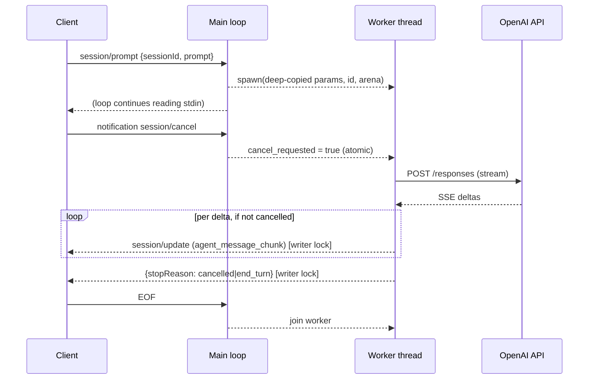

# Plan: OpenAI Responses provider adapter (F4)

## Scope

Wire the server to a real model backend — OpenAI Responses API (or any
OpenAI-compatible endpoint, e.g. DeepSeek) — with streaming, configuration,
startup validation, and the preemptive cancellation deferred from F3.

**In scope:**
- `config.zig` — env config: `OPENAI_API_KEY` (required for real calls),
  `OPENAI_URL` (default `https://api.openai.com/v1`), `OPENAI_MODEL`
  (default `deepseek-v4-flash`), `OPENAI_EFFORT` (default `high`, maps to
  `reasoning.effort`)
- Startup **health check** when the key is present: `GET {OPENAI_URL}/models`
  with Bearer auth — fail fast on bad key / unreachable endpoint. Missing
  key → lazy (fails at first prompt with a clear error)
- `util/http.zig` — `std.http.Client` wrapper (JSON request helper, Bearer
  header, error mapping)
- `provider/openai.zig` — Responses API implementation: POST `/responses`
  with `{model, input, reasoning: {effort}, stream: true,
  stream_options: {include_usage: true}}`; SSE parse; emit text deltas,
  usage, stop reason
- **Worker-thread cancellation** (from F3 decision): `session/prompt` deep-
  copies params, spawns a worker thread; main loop keeps reading stdin;
  `session/cancel` sets an atomic flag the worker checks between SSE events;
  worker answers `{stopReason: cancelled}` per the schema MUST. Writer access
  is mutex-guarded; the loop joins the worker at EOF
- Tests: mock SSE server (`std.http.Server` on an ephemeral port) serving
  scripted `/responses` streams + `/models` health; config tests; cancel test

**Out of scope (this feature):** tools (`tools` param, `function_call` items —
F5), session history across prompts (single-turn input per prompt for now;
multi-turn context is a F5/Epic-2 concern), image/audio content, MCP.

## Architecture

### Data layer

```
Config {
  api_key: ?[]const u8,     // null → lazy fail at first prompt
  base_url: std.Uri,        // default https://api.openai.com/v1
  model: []const u8,        // default "deepseek-v4-flash"
  effort: []const u8,       // default "high"
}

Context + {
  config: Config,
  http: *std.http.Client,          // process-lifetime, one prompt at a time
  writer_lock: std.Thread.Mutex,   // main loop + worker share stdout
  cancel_requested: std.atomic.Value(bool),
}
```

### Function layer

- `config.load(environ, allocator) !Config` — parse env; defaults applied;
  key missing → `.api_key = null` (lazy)
- `config.healthCheck(http, config) !void` — `GET {base}/models`, Bearer;
  2xx → OK; 401/403 → bad key; network → unreachable. Called at startup when
  key present; failure → startup error
- `openai.generate(http, config, input_text) !GenerateResult` — build body,
  POST, stream SSE:
  - `response.output_text.delta` → text chunks
  - `response.completed` → stop `end_turn` (usage from final event)
  - `response.failed` / `response.incomplete` → mapped stop reason
  - network/HTTP error → error (mapped by the prompt handler)
- SSE parse: body lines `data: <json>`; skip comments/keepalives

### Context layer (worker-thread cancellation)



- `session/prompt` handler: validate, deep-copy params into a fresh arena,
  spawn worker, return `error.DeferredResponse` (dispatch writes nothing —
  the worker owns the turn's output)
- Worker: runs `openai.generate`, emitting notifications (writer lock per
  chunk, flush each), then the final response; checks `cancel_requested`
  between SSE events (abort → `cancelled`); frees its arena
- `session/cancel`: sets the atomic flag (main loop); per-session scoping not
  needed while at most one prompt runs
- All writer access (error responses, notifications, responses) takes
  `writer_lock`

### API / Contract

- Prompt response: `{stopReason: "end_turn" | "cancelled"}` (schema
  `PromptResponse`); usage forwarded as a `usage_update` notification
  (`{used, size}` — the fossil client reads these)
- HTTP/network/provider errors: before any chunk → JSON-RPC error response
  (mapped -32603 or -32602); mid-stream → stop early with a log
- Health check failure at startup: log + exit non-zero

## Units of Work

1. **Config** — `config.zig` env parsing + defaults + tests
   - *Checkpoint:* unit tests — defaults, overrides, missing key → null
2. **Health check** — `GET {base}/models` via `std.http.Client`
   - *Checkpoint:* mock server test — 200 passes, 401 fails, unreachable fails
3. **HTTP wrapper** — `util/http.zig` JSON request helper + error mapping
   - *Checkpoint:* mock server round-trip test
4. **OpenAI Responses impl** — request build + SSE parse + event mapping
   - *Checkpoint:* mock SSE test — scripted deltas → chunks; completed → end_turn;
     usage → usage_update; failed → error
5. **Worker-thread prompt + cancel** — deep-copy, spawn, atomic flag, writer
   lock, join at EOF
   - *Checkpoint:* cancel mid-stream test — `cancelled` stop reason; concurrent
     loop behavior; no deadlock at EOF
6. **Wiring + startup** — main.zig: config load + health check before run;
   Context updates
   - *Checkpoint:* binary smoke with mock server end-to-end; fmt; tests; commit

## Verification Strategy

- **Data:** request body exact JSON (model, reasoning.effort, stream flags);
  SSE parse edge cases (comment lines, multiple `data:` in one read, trailing
  newline, CRLF)
- **Function:** config defaults/overrides; health check branches (200/401/ERR);
  event mapping table (delta/completed/failed/incomplete); usage extraction
- **Context:** cancel mid-stream → `cancelled`; EOF with worker active → join,
  clean exit; writer lock serializes concurrent writes; no leaks (testing
  allocator incl. worker arenas)
- **API:** full transcript with mock provider — initialize → session/new →
  session/prompt (streamed) → response → cancel; health check failure
  behavior

## Integration Contract (fossil client + OpenAI Responses)

- Client sends `session/prompt`; reads `session/update` notifications
  (`agent_message_chunk` appends `content.text`; `usage_update` reads
  `used`/`size`) — matches our emit shape (verified in F3)
- OpenAI Responses: `POST {base}/responses`; SSE events parsed by `type`;
  final event carries usage with `stream_options.include_usage`
- DeepSeek (user's actual backend): `OPENAI_URL=https://api.deepseek.com/v1`,
  `OPENAI_MODEL=deepseek-v4-flash`, `reasoning.effort=high` — DeepSeek
  documents the Responses API + `/v1` OpenAI-compatible alias (verified during
  setup research)

## References

- `.ai/knowledge/references/openai-api.md` — Responses API extraction
  (request fields, output items, SSE events, usage)
- `.ai/knowledge/decisions.md` — F3 cancellation scoping (carried into F4)
- `~/Downloads/fossil-linux-x64-2.28/fossil-agent.tcl` — client update consumption

## Status

- **Stage:** 1 (Planning)
- **Current unit:** —
- **Last checkpoint:** Plan written and reviewed
- **Next action:** User approval, then prototype
