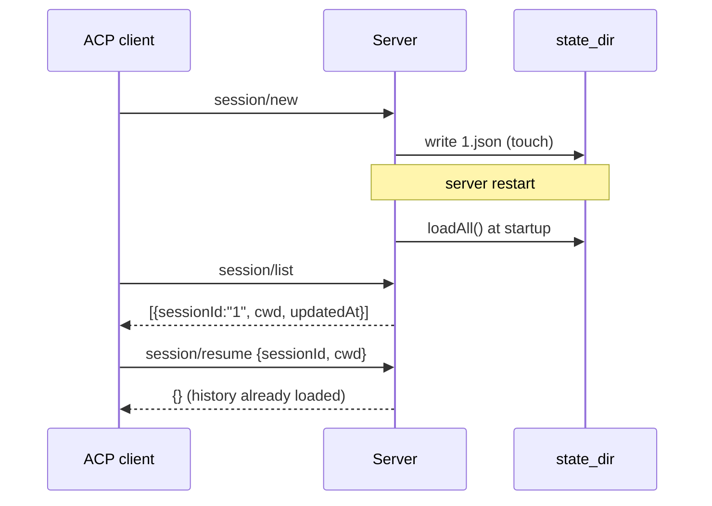

# Plan: Session persistence

**Branch:** `feature/session-persistence`
**Created:** 2026-10-04
**Backlog:** `.ai/backlog/3.md` — `feature/session-persistence`
**Depends on:** ACP v1 schema v1.24.1 session lifecycle methods

## Scope

Persist sessions so they survive server restarts, and expose the stable v1
session lifecycle methods: `session/list`, `session/resume`, `session/delete`,
`session/close`. Storage is a directory of one JSON snapshot per session
(file-based, not a DB).

## Architecture

- **Store** (`src/protocol/v1/types.zig`): `SessionStore` now stores
  `StringHashMap(*Session)` (stable pointers, so `close`/`delete` never
  invalidate a worker's pointer) and an optional `Io.Dir` snapshot directory.
  - `touch(io, session)` stamps `updated_at` and saves.
  - `save` writes `{sessionId, cwd, provider, config, history, updatedAt}`.
  - `loadAll` reads every `*.json` at startup and advances `next_id`.
  - `remove` deletes the memory entry **and** the snapshot.
  - All persistence is best-effort: failures are logged, never propagated
    (persistence must not break a turn).
- **Config** (`src/config.zig`): `state_dir` resolved from the config field,
  `$ACPS_STATE_DIR`, or the XDG state home (`~/.local/state/acps/sessions`).
- **Server** (`src/server.zig`): create + open the state dir (iterate access),
  attach it to the store, then `loadAll`.
- **Handlers** (`src/protocol/v1/methods.zig`): `session/list` (SessionInfo:
  id, cwd, updatedAt; optional `cwd` filter), `session/resume` (validates
  sessionId + cwd match), `session/delete` (store.remove), `session/close`
  (cancels an active prompt; session stays listable/resumable). `initialize`
  advertises `sessionCapabilities: {list,resume,delete,close}`.

### Persistence flow

## Units of Work

1. Store refactor + persistence (`types.zig`) — map of `*Session`, save/load/
   remove/touch. *verified by 2 store tests.*
2. Config `state_dir` resolution + `server.run` wiring. *verified by config
   test + e2e restart.*
3. Handlers + registry + `initialize` capabilities. *verified by server
   lifecycle test.*
4. Docs/knowledge updates.

## Verification Strategy

- `zig build test`: store round-trip (config + history + next_id), remove,
  server lifecycle (`new → list → resume → delete → list`), config `state_dir`.
- End-to-end: run the binary with `state_dir`, `session/new`, exit; run again,
  `session/list` shows the persisted session; `session/resume` succeeds.
- `zig fmt --check .`, `zig build`.

## Status

- **Stage:** Review — complete; merged to `main` (adc9b3d)
- **Current unit:** U1–U4
- **Next action:** —
