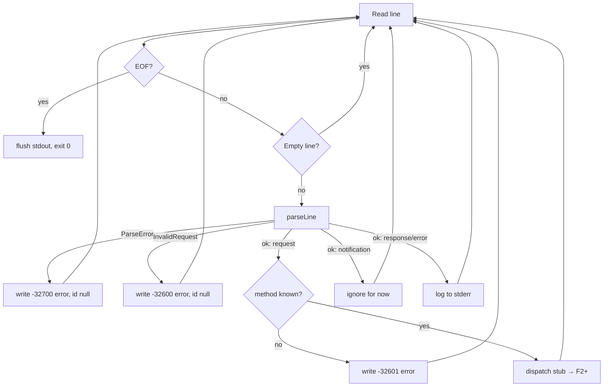

# Plan: stdio JSON-RPC 2.0 transport (F1)

## Scope

Implement the ACP transport layer: newline-delimited JSON-RPC 2.0 over
stdin/stdout — parse, serialize, and a minimal dispatch loop in `main.zig`.
No session/thread/turn logic (that is F3); method handlers land in F2.

**In scope:**
- `Message` type: request / notification / response / error response
- Strict envelope validation (`"jsonrpc":"2.0"` required)
- `RequestId` verbatim round-trip (union: null | int64 | string)
- Line framing: one JSON object per line, empty lines skipped (keepalive)
- Bidirectional write path (responses + notifications) — notifications are
  required by later features and must be writable from day one
- Dispatch stub: unknown method → `-32601`; malformed → `-32700` (id null)
- stdin EOF → flush stdout, exit 0 (never write to a closed pipe)
- stderr-only logging (stdout is protocol-only)

**Out of scope (this feature):** method handlers (`initialize`, `session/*`,
`turn/*`, `tool/*`), capabilities, state, ACP-specific error codes beyond the
standard set + `-32800` (enumeration lands in F2), batch requests.

## Architecture

### Data layer

```
Message = union(enum) {
    request:        Request,        // { jsonrpc, id, method, params }
    notification:   Notification,   // { jsonrpc, method, params }
    response:       Response,       // { jsonrpc, id, result }
    error_response: ErrorResponse,  // { jsonrpc, id, error }
}

RequestId = union(enum) { null, int: i64, string: []const u8 }
ErrorObject = struct { code: i32, message: []const u8, data: ?std.json.Value }
```

- `params` / `result` are `std.json.Value` — opaque at this layer; interpreted
  by method handlers in F2+.
- All strings/values are allocator-owned (per-message arena).

### Function layer

- `parseLine(allocator, line) !Message` — strict validation:
  - malformed JSON → `error.ParseError` (-32700)
  - missing/incorrect `jsonrpc`, wrong shape (id+method / method-only /
    id+result / id+error) → `error.InvalidRequest` (-32600)
  - JSON array (batch) → `error.InvalidRequest` (-32600) — ACP never batches
- `serialize(allocator, message) ![]u8` — single-line JSON, no embedded
  newlines (string escaping handled by `std.json`)

### Context layer

- Process-lifetime arena: transport loop, buffers
- Per-message arena: parse + serialize allocations, reset each line
- Line buffer: fixed cap (16 MiB) — exceeding it is a parse error (-32700)
  and the loop continues

<!-- 2025-08-10T23:10: Implementation — std.Io reader buffer bounds line length via takeDelimiter StreamTooLong; fixed 16 MiB buffer is wasteful, 1 MiB chosen for MVP with discard+recovery -->
- ~~Line buffer: fixed cap (16 MiB) — exceeding it is a parse error (-32700) and the loop continues~~
- Line buffer: 1 MiB stdin reader buffer; `takeDelimiter` `StreamTooLong` → discard the oversized line (`discardDelimiterInclusive`) and answer -32700, connection stays alive. Revisit with dynamic growth if tool results (F5) exceed it.

### API / Contract

```
Transport:
  readMessage(allocator, stdin)  !?Message   // null on EOF; skips empty lines
  writeMessage(stdout, message)  !void       // one line + '\n', flush
```

`main.zig` loop:



## Units of Work

1. **Spike: pin Zig 0.16 idioms** — verify `std.json` parse/stringify and
   `std.Io` stdin read / line-read APIs compile as expected
   - *Checkpoint:* small throwaway test compiles and runs under
     `zig build test`; APIs documented in `.ai/knowledge/`
2. **`Message` + `RequestId` + parse/serialize** in `protocol/json_rpc.zig`
   - *Checkpoint:* unit tests — valid request/notification/response/error;
     `id` verbatim round-trip (`1` int, `"abc"` string, `null`); malformed
     JSON, missing `jsonrpc`, batch array, truncated line
3. **Line framing + `Transport`** — read/write with empty-line skip
   - *Checkpoint:* in-memory reader/writer round-trip tests incl. keepalive
     lines and multi-line streams
4. **`main.zig` dispatch loop** — parse → respond, EOF → clean exit
   - *Checkpoint:* pipe-based test spawning the binary with scripted input;
     assert exact stdout transcript
5. **Fossil-client transcript fixture** — capture a representative
   client exchange (initialize-era shape, unknown method) as an integration
   test
   - *Checkpoint:* fixture passes; `zig build test` green end-to-end
6. **Conformance pass** — `zig fmt --check`, full test suite, pre-commit hook
   - *Checkpoint:* hook passes; commit

## Verification Strategy

- **Data layer:** round-trip tests for every `Message` variant; `RequestId`
  boundary values (i64 min/max, empty string, null); malformed inputs
  (bad JSON, missing `jsonrpc`, array batch, non-object root, empty line,
  16 MiB+ line)
- **Function layer:** branch coverage of `parseLine` error paths (all JSON-RPC
  codes), `serialize` escaping (embedded newline in string content)
- **Context layer:** per-message arena reset — leak detection via
  `std.testing.allocator` on all parse/serialize paths
- **API layer:** contract tests via pipe harness — exact stdout bytes;
  EOF handling (no write-after-EOF); stderr isolated from stdout

## Integration Contract (from fossil client, read-only reference)

- `~/Downloads/fossil-linux-x64-2.28/fossil-agent.tcl` (do not modify)
  - `rpc.tcl`: one JSON object per line, `jsonrpc:"2.0"` required, empty
    lines = keepalive
  - `id` correlation: Tcl string equality (`ne`) → **verbatim echo**
  - client sends monotonic integer ids; notifies `session/cancel` on cancel
  - error code `-32800` = request cancelled (client convention)
  - EOF from agent = subprocess closed; writes to closed pipe pollute stderr

## References

- `.ai/knowledge/references/acp-schema-v1.json` — `AgentRequest`,
  `AgentResponse`, `RequestId`, `Error` definitions
- `.ai/knowledge/references/acp-openai-research.md`
- `~/Downloads/fossil-linux-x64-2.28/fossil-agent.tcl` — client contract
- JSON-RPC 2.0 spec: https://www.jsonrpc.org/specification

## Status

- **Stage:** 4 (Complete — merged to main as `29893fd`)
- **Current unit:** —
- **Last checkpoint:** Squash-merged, branch deleted; 19/19 tests, fmt clean
- **Next action:** None — task done in `.ai/backlog/1.md`

---

## Outcomes

### What was implemented
- `src/protocol/json_rpc.zig` — `Message` (request/notification/response/error_response), `RequestId` (null/int64/string), `ErrorObject`, `ErrorCode` (standard + -32800); `parseLine` with strict envelope validation (`"jsonrpc":"2.0"`, shape dispatch, batch rejection); `serializeRequest/Notification/Response/Error` as single-line JSON
- `src/main.zig` — newline-delimited stdio loop: keepalive skip, parse-error recovery (id null), oversized-line discard (1 MiB reader buffer), clean exit on stdin EOF with no further writes; dispatch stub answers every request with -32601
- `tests/transport-smoke.sh` — scripted transcript fixture (fossil-client-shaped messages), diffed against exact stdout

### Changes from the original plan
- Line buffer 16 MiB → 1 MiB with `StreamTooLong` discard+recovery (std.Io `takeDelimiter` is bounded by the reader buffer; documented in decisions.md)
- Units 1–2 merged in practice (spike folded into the json_rpc.zig implementation — the tests *are* the idiom pinning); `std.json` union field access is non-optional in 0.16 (switch-based extraction), `Stringify.value` needs an explicit `std.json.Value{...}` annotation (anonymous struct literal otherwise)
- `printBanner` scaffold demo removed (dead code once the transport loop landed)
- Review iteration: loop extracted from `main.zig` into `src/server.zig` (`run(reader, writer, gpa)` against `Io.Reader`/`Io.Writer` interfaces) so the transcript fixture runs in-process under the Zig test framework (19 tests); `main.zig` only wires stdio files; `tests/transport-smoke.sh` retained as manual E2E

### Use cases resolved
- Client sends request on stdin → server responds on stdout with matching verbatim id ✓ (unit + fixture)
- Client sends notification → no response, connection continues ✓
- Malformed line → -32700 parse error (id null), connection survives ✓
- Unknown method → -32601 method not found ✓
- Empty/keepalive lines skipped ✓
- EOF (client closes pipes) → clean exit, no writes after EOF ✓
- Oversized line → discarded, -32700, connection survives ✓
- Dropped: none. Added: -32800 cancellation code constant (client convention, used by F3)

### Verification results
- All checkpoints passed: yes
- Full test suite: 14/14 passing (`zig build test`); fmt clean; transcript fixture OK
- Benchmarks: n/a (no perf-sensitive paths in this feature; stdio loop uses buffered Io)

### Knowledge updates
- New glossary terms: `protocolVersion` (added earlier); Zig 0.16 std.json/Io idioms (see `.ai/knowledge/glossary.md`)
- Architecture decisions updated: transport conventions in `decisions.md` (framing, RequestId verbatim, EOF, batches, line cap)
- References: ACP v1 schema + OpenAI extraction + research summary (added during setup)
