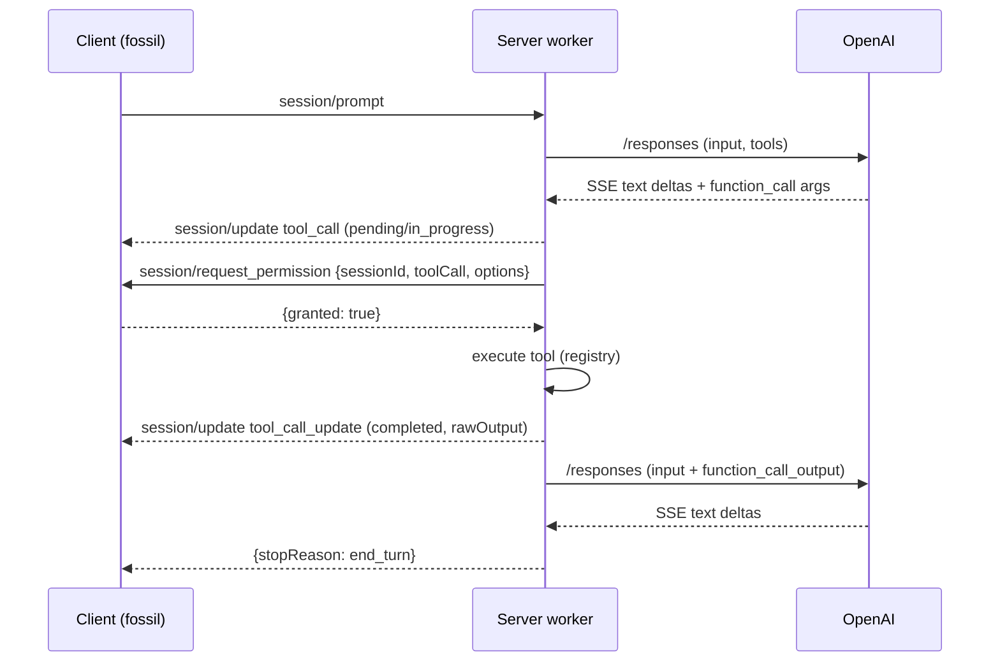

# Plan: tool-call round-trip (F5)

## Scope

Complete the MVP's tool loop: the model requests a tool, the server reports it
to the client, asks permission, executes agent-side (ACP v1: "the agent
executes"), and feeds the result back into the next provider call. Adds a
data-driven server tool registry, session history, and the F4 HTTP-timeout
follow-up.

**In scope:**
- Server-side tool registry: `{name, description, parameters (JSON schema),
  kind, execute fn}` — MVP ships one built-in tool (`get_current_time`);
  registry is data-driven and extensible
- Provider: `tools` request param; collect `function_call` output items
  (SSE `response.function_call_arguments.delta` accumulation) into `Result`;
  `input` built from session history + current prompt + prior tool results
  (`function_call_output` items)
- Worker multi-call loop: generate → execute tool calls (permission, report,
  run) → append results → repeat until no calls (cap 8)
- **Permission** (client-persisted, per user decision): `session/request_permission`
  with options `allow_once` / `allow_always` / `reject_once`; honor the
  response (schema `outcome` selected/cancelled, plus the fossil client's
  `{granted: bool}` shape). Server stays stateless on grants — session/
  workspace-bound persistence is the client's policy
- Tool reporting: `session/update` notifications `tool_call` (pending →
  in_progress) + `tool_call_update` (completed, `rawOutput`)
- Session history: in-memory per-session accumulation (user/assistant/tool
  messages, ~20), so the agent holds context across prompts (ACP model)
- HTTP request timeout (F4 follow-up) so a hung provider can't block EOF

**Out of scope (this feature):** real fossil tools (client-side registry
concern), `session/load`/`list`/`delete`/`resume`/`close`, streaming tool
calls (OpenAI parallel tool calls are sequential for now), persistence.

## Architecture

### Data layer

```
tools/registry.zig
  Tool { name, description, kind (ACP ToolKind), parameters (JSON schema
         text), execute: fn(allocator, args_json) ![]const u8 }
  registry: []const Tool   // MVP: get_current_time

provider/adapter.zig (extended)
  ToolCall { id, name, arguments }        // from function_call output items
  ToolResult { call_id, output }
  Result + { tool_calls: []ToolCall }
  generate(allocator, input_items, tool_results, options) !Result
    // input_items: prebuilt std.json.Array of message items from history +
    // current prompt; tool_results appended as function_call_output items

Session + { history: ArrayList(Message) }  // Message {role, text, tool?}

PendingPermission { mutex, request_id, done, granted }
```

### Function layer

- `tools.lookup(name) ?*const Tool`; executors return result text (errors →
  `"ERROR: ..."` text fed back to the model — client `_safeCall` pattern)
- Provider SSE: `response.function_call_arguments.delta` → accumulate into
  the current call; `response.output_item.done` with `type == function_call`
  → finalize a `ToolCall`
- Permission: worker sends `session/request_permission` (agent→client request
  with a worker-generated id), spins on `PendingPermission.done`; the main
  loop routes inbound responses with a matching id into the slot. Response
  shapes: `{granted: bool}` (fossil) or `{outcome: ...}` (schema)
- Worker loop (per prompt):
  1. build input from session history + current prompt
  2. `generate` → emit text chunks (existing), collect tool_calls
  3. no calls → finalize (end_turn)
  4. for each call: `tool_call` notification → `session/request_permission` →
     granted? report in_progress, execute, `tool_call_update` (completed,
     rawOutput); denied → result text "permission denied"
  5. append ToolResults; repeat from 2 (cap 8)

### Context layer

- Session history lives in the session store (process arena); the worker
  reads + appends under the writer/state lock (single worker, so a simple
  mutex or atomic append suffices — history writes happen in the worker
  thread while the loop reads sessions for validation only)
- `PendingPermission` is single-slot (one prompt at a time)
- HTTP timeout on the provider request

### API / Contract



- `session/request_permission` request id: worker counter, e.g. `"p1"`,
  `"p2"`; main loop matches `response.id`
- Tool notifications match the fossil client's consumption (`session/update`
  `tool_call`/`tool_call_update` → records `title`/`rawInput`/`content`/
  `status`)

## Units of Work

1. **Tool registry + get_current_time** — `tools/registry.zig` + executor
   - *Checkpoint:* unit tests — lookup hit/miss, executor output (ISO time),
     error → "ERROR: ..." text
2. **Provider tool support** — `tools` param, `function_call` collection from
   SSE, `ToolCall` in Result, `input_items` + `function_call_output` results
   - *Checkpoint:* mock SSE tests — function_call args deltas → ToolCall;
     request body has tools + prior results as function_call_output
3. **Permission routing** — `PendingPermission` slot; worker sends
   request_permission + waits; main loop routes inbound responses
   - *Checkpoint:* transcript test — request_permission sent, response routed,
     granted/denied handled (both response shapes)
4. **Worker multi-call loop + reporting** — tool_call/tool_call_update
   notifications, execution, iteration cap
   - *Checkpoint:* transcript test — prompt with tool call → notifications →
     granted → execution result → final text; denial path
5. **Session history** — accumulation + input building across prompts
   - *Checkpoint:* transcript test — second prompt includes first turn's
     context in the provider request (mock assert)
6. **HTTP timeout + conformance** — provider request timeout; fmt, tests,
   fixture, commit
   - *Checkpoint:* hook passes; commit

## Verification Strategy

- **Data:** request body exact JSON (tools array, function_call_output items);
  ToolCall collection from scripted SSE; history message shapes
- **Function:** executor branches (valid args, malformed args, missing);
  permission response parsing (granted / outcome selected / outcome
  cancelled); loop cap
- **Context:** single-slot permission (no deadlock — worker spins with
  yield); history survives multiple prompts; no leaks
- **API:** full transcript — prompt → tool call → permission → execute →
  result → final answer; denial path; second prompt with context

## Integration Contract (fossil client + OpenAI Responses)

- Client: `session/request_permission` → `{granted: true}` (auto-grant; u3
  policy mapping). Client consumes `session/update` `tool_call`/`tool_call_update`
  for display (`title`, `rawInput`, `content`, `status`) and `usage_update`
  — our notification shapes match (verified in F3/F4)
- OpenAI: `tools` param (function type: name, description, parameters),
  `function_call` output items (call_id, name, arguments), SSE
  `response.function_call_arguments.delta`/`.done`, input items
  `function_call_output {type, call_id, output}`
- Permission persistence: **client-side** (user decision) — server presents
  options per call and stays stateless on grants

## References

- `.ai/knowledge/references/acp-schema-v1.json` — `ToolCall`, `ToolCallUpdate`,
  `ToolKind`, `ToolCallStatus`, `RequestPermissionRequest/Response`,
  `PermissionOption`, `PermissionOptionKind`
- `.ai/knowledge/references/openai-api.md` — `FunctionTool`, `FunctionToolCall`,
  `function_call_arguments` events, `function_call_output` input item
- `~/Downloads/fossil-linux-x64-2.28/fossil-agent.tcl` — auto-grant, display
  consumption, `_safeCall` error pattern

## Status

- **Stage:** 2 (Implementation)
- **Current unit:** 6 (Conformance)
- **Last checkpoint:** Units 1–5 done — tool registry, provider tools/function_call, permission routing, worker multi-call loop, session history; 47/47 tests
- **Next action:** commit, then review

---

## Outcomes

### What was implemented
- `src/tools/registry.zig` — data-driven Tool registry + `get_current_time` +
  `echo` executors
- `src/provider/adapter.zig` — `ToolCall`/`ToolResult`/`Result.tool_calls`;
  push-based generate takes input items + tool results + tool defs
- `src/provider/openai.zig` — `tools` request param; function_call SSE
  collection; `function_call_output` input items
- `src/protocol/v1/methods.zig` — worker multi-call loop, permission slot
  (`PendingPermission`), tool reporting notifications, session history
- `src/server.zig` — permission response routing; `run` takes the provider
- `src/main.zig` — wires the openai provider (F4 gap: the binary still used
  echo)

### Changes from the original plan
- Permission slot armed in `sessionPrompt` (not the worker) after a race was
  found — the loop processed the client's response before the worker armed
  the slot
- Full-transcript history test dropped (read-ahead race, test artifact);
  replaced with a worker-level `buildInput` unit test
- `echo` tool added to the registry for deterministic round-trip testing

### Use cases resolved
- Model requests a tool → reported (`tool_call`/`tool_call_update`) ✓
- Permission requested (`session/request_permission`), client response
  routed, honored ✓ (granted/denied/outcome shapes)
- Tool executed agent-side, result fed back into the next provider call ✓
- Multi-call loop until no more tool calls (cap 8) ✓
- Session context accumulates across prompts ✓
- Binary uses the real openai provider ✓

### Verification results
- All checkpoints passed: yes
- Full test suite: 47/47 passing; fmt clean; smoke fixture OK
- Benchmarks: n/a

### Knowledge updates
- decisions.md: F5 entry (registry, permission model, loop, history)
- glossary.md: tool-call flow terms (ToolCall, request_permission,
  function_call/function_call_output)
- backlog: F5 marked done on merge

## Status
- **Stage:** 4 (Complete — merged to main as `5d10f34`) — see Status above for the implementation checkpoint
