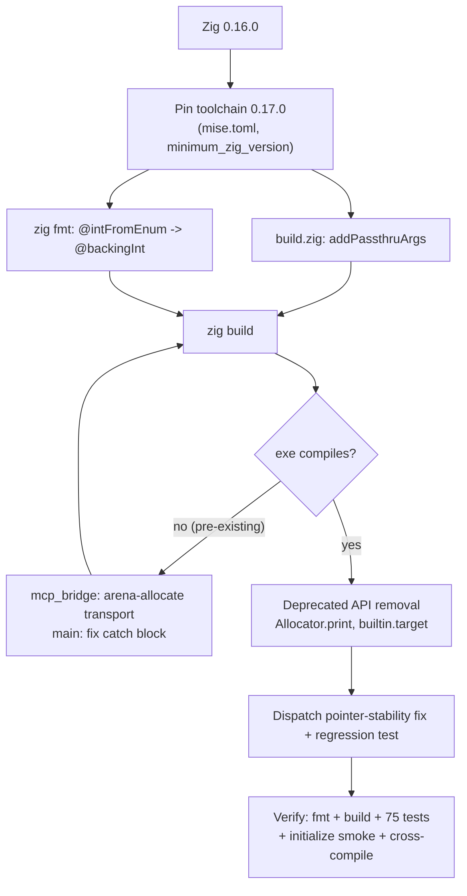

# Plan: Zig 0.17.0 toolchain migration

**Branch:** `feature/zig_0_17_migration`
**Created:** 2026-10-04
**Source:** [Zig 0.17.0 Release Notes](https://ziglang.org/download/0.17.0/release-notes.html)

## Scope

Upgrade acps from Zig 0.16.0 to **0.17.0**: build-system API changes, the
language/formatting migration, stdlib deprecation removal, version metadata,
and the **executable-build regressions the upgrade surfaced**. The project does
not use any deprecated stdlib API (standing principle: no deprecated APIs
before Zig 1.0), including ones that still compile on 0.17.0.

### In scope

- `build.zig`: `b.args` removed → Run step `addPassthruArgs()`.
- `zig fmt` language migration: `@intFromEnum` → `@backingInt` (3 files).
- **Executable-build fixes** (`zig build` was already broken on 0.16.0; see
  Context). These are required for the migration to be verifiable.
- Deprecated-API removal: `std.fmt.allocPrint` → `Allocator.print`;
  `builtin.os.tag` → `builtin.target.os.tag`.
- Version metadata: `build.zig.zon` `minimum_zig_version`, `mise.toml` pin.
- Pre-commit hook: add `zig build` (the gap that let broken builds land) and
  document how to install the versioned hook.
- Latent `Dispatch` pointer-stability fix in `mcp_bridge.buildToolSurface`
  (discovered while fixing the transport lifetime) + regression test.
- Knowledge base updates (decisions, glossary, architecture, bibliography,
  saved release-notes reference).

### Out of scope

- ACP v2, session persistence, per-session multi-LLM, Chat Completions adapter,
  `mcp_client` extraction — all tracked in `.ai/backlog/3.md`.
- Adopting new 0.17.0 features not required for the upgrade (`SafeAllocator`,
  `@divCeil`, `@backingInt`/`@fromBackingInt` beyond the fmt migration).

## Context / findings

The release-notes review (see saved reference) identified the affected
surfaces. Two of them turned out to be **pre-existing breakage**, not 0.17
regressions:

1. **`src/mcp_bridge.zig` called `*T` method `transport()` on a `const`
   loop-local.** Reproduced on a clean 0.16.0 worktree of `HEAD`: `zig build`
   fails identically on 0.16.0. The underlying issue is worse than constness —
   the `StdioTransport` was stack-local inside the `for` loop while the
   `Client` stores a `Transport.ctx` pointer to it, so every `Connection`
   held a dangling transport pointer.
2. **`src/main.zig`'s `catch` block yielded `void`** (last statement
   `&.{};` carried a semicolon and its pointer value was discarded), also
   rejected by 0.16.0.

Both were invisible to `zig build test` because tests never analyze `main`,
and the versioned `.githooks/pre-commit` was **not installed** (`core.hooksPath`
unset; `.git/hooks/` held only samples). CI runs `zig build`, so this path was
never actually green.

0.17.0 changes audited and found **not applicable**: `@bitCast` array/vector/
extern-struct semantics (no `@bitCast` in repo); `mem.eql`/`findDiff` float
handling (only byte/string comparisons); `std.zon`, `bit_set`, `ArrayList.getLast`,
`DoublyLinkedList.pop`, `StackFallbackAllocator`, `std.meta.fieldInfo`,
`@import("builtin")` cpu/abi/object_format (unused). `std.json.Value` still has
no recursive `deinit`, so the `Parsed` arena model stands (comment generalized).

## Architecture / approach

The upgrade has three layers, applied in order:

1. **Toolchain / build surface** — pin the compiler and update the build API.
2. **Language / stdlib surface** — the compiler-guided mechanical edits
   (`zig fmt` migration) plus removal of deprecated APIs.
3. **Latent-correctness surface** — make the executable actually compile and
   remove the pointer-lifetime hazards the compiler exposed.

## Units of Work

### U1 — Build-system + formatting conformance
- **What:** `build.zig` `if (b.args) |args| run_cmd.addArgs(args);` →
  `run_cmd.addPassthruArgs();`. Run `zig fmt` for the `@intFromEnum` →
  `@backingInt` auto-upgrade in `util/log.zig`, `util/http.zig`,
  `protocol/v1/methods.zig`.
- **Verification:** `zig fmt --check .` exits 0; `zig build` configures.
- **Depends:** none.

### U2 — Make the executable compile (latent regressions)
- **What:** In `mcp_bridge.connectAll`, allocate `StdioTransport` from the
  arena (`allocator.create`) so it outlives the loop iteration and the returned
  connection list. In `main.zig`, make the `connectAll` catch handler yield an
  empty slice (`break :blk &.{}`).
- **Verification:** `zig build` succeeds; `zig build run` with an inline
  `ACP_CONFIG` answers an `initialize` request.
- **Depends:** U1.

### U3 — Version metadata + toolchain pin
- **What:** `build.zig.zon` `.minimum_zig_version = "0.17.0"`; `mise.toml`
  `zig = "0.17.0"` (was `"latest"` — pinning makes CI deterministic through
  `jdx/mise-action`).
- **Verification:** `zig build` succeeds under 0.17.0; `zig build` fails under
  0.16.0 (confirms the floor).
- **Depends:** none.

### U4 — Deprecated-API removal
- **What:** `std.fmt.allocPrint(alloc, …)` → `alloc.print(…)` (11 sites);
  `builtin.os.tag` / `@import("builtin").os.tag` → `builtin.target.os.tag`
  (2 sites). No deprecated stdlib API remains.
- **Verification:** `rg 'allocPrint|builtin\.os\.|@intFromEnum|@enumFromInt' src`
  returns nothing; build + tests pass.
- **Depends:** U2.

### U5 — `Dispatch` pointer stability
- **What:** `buildToolSurface` stored `&dispatches.items[i]` in `Tool.ctx`; a
  later `ArrayList` append could reallocate and invalidate earlier ctx
  pointers. Allocate each `Dispatch` individually (`allocator.create`) so the
  pointer is stable. Add a two-server routing test that executes each tool
  against its owning mock.
- **Verification:** new test passes; total suite 75/75.
- **Depends:** U2.

### U6 — Pre-commit hardening
- **What:** Add `zig build` to `.githooks/pre-commit` (before `zig build test`),
  with a comment explaining that tests do not analyze `main`. Document
  `git config core.hooksPath .githooks` in the README; set it for this clone.
- **Verification:** hook runs fmt + build + test; README documents install.
- **Depends:** U1–U5 (hook must pass on the finished tree).

### U7 — Knowledge base + docs
- **What:** Record decisions; update glossary ("Zig 0.16 stdlib idioms" → 0.17
  with `@backingInt`/`addPassthruArgs`/`Allocator.print`/`builtin.target`);
  update architecture gotchas; add release-notes bibliography entry + saved
  distilled reference; generalize the stale `json_rpc.zig` 0.16 comment; add
  the migration task to `.ai/backlog/3.md`.
- **Verification:** files present and cross-referenced; no stale 0.16 claims in
  current docs.
- **Depends:** U1–U6.

## Verification Strategy

- **Build system / language:** `zig fmt --check .`; `zig build`.
- **Unit / integration:** `zig build test --summary all` → 75/75 across the
  `acps`, `json_rpc`, `mcp_client`, and exe test targets.
- **Runtime:** pipe an `initialize` JSON-RPC line into `zig build run` with an
  inline `ACP_CONFIG`; expect a well-formed `InitializeResponse`.
- **Release targets:** cross-compile `--release=small` for
  `x86_64-linux-gnu`, `aarch64-macos`, `x86_64-windows-gnu`.
- **Version floor:** confirm 0.16.0 rejects the tree (negative check).
- **No deprecated APIs:** `rg` sweep over `src/` and `build.zig`.

## References

- Zig 0.17.0 Release Notes — https://ziglang.org/download/0.17.0/release-notes.html
  (distilled copy: `.ai/knowledge/references/zig-0.17-release-notes.md`)
- `.ai/knowledge/decisions.md` — 2026-10-04 entries
- `.ai/knowledge/architecture.md` — Zig 0.17 gotchas

## Status

- **Stage:** 3 (Review) — complete; squash-merged to `main` (2294747)
- **Current unit:** —
- **Last checkpoint:** merged; `zig fmt --check .` clean, `zig build` 3/3, 75/75 tests, `initialize` smoke, cross-compile (linux-gnu / macos-arm / windows-gnu), 0.16 negative check; pre-commit hook green
- **Next action:** — (feature branch deleted)

<!-- 2026-10-04T07:20: Outcomes captured after Implementation + final verification (Review stage) -->

## Outcomes

### What was implemented

- Toolchain pinned to 0.17.0: `mise.toml` (`zig = "0.17.0"`) and
  `build.zig.zon` (`minimum_zig_version = "0.17.0"`).
- `build.zig`: `b.args` block replaced with `run_cmd.addPassthruArgs()`.
- `zig fmt` language migration: `@intFromEnum` → `@backingInt` in
  `util/log.zig`, `util/http.zig`, `protocol/v1/methods.zig`.
- Executable-build fixes: `mcp_bridge.connectAll` arena-allocates the
  `StdioTransport`; `main.zig` catch block yields `break :blk &.{}`.
- Deprecated-API removal: `std.fmt.allocPrint` → `Allocator.print` (11 sites),
  `builtin.os` → `builtin.target.os` (2 sites).
- `mcp_bridge.buildToolSurface`: each `Dispatch` is individually allocated so
  `Tool.ctx` survives `ArrayList` growth; two-server routing regression test.
- Pre-commit hook runs `zig build` in addition to fmt/test; README and
  AGENTS.md document `git config core.hooksPath .githooks`.
- Knowledge base, backlog task, plan, verify, and saved release-notes
  reference.

### Changes from the original plan

- U5 (`Dispatch` stability) and U6 (hook hardening) were unplanned; both were
  surfaced while fixing the transport lifetime and the hook gap.
- Scope grew to cover **pre-existing** (non-0.17) executable breakage. Fixing
  it was unavoidable: the migration's build verification cannot pass without it.
- The `json_rpc.zig` 0.16 comment was generalized rather than version-bumped:
  `std.json.Value` still has no recursive deinit in 0.17, so the arena model
  is unchanged.

### Use cases resolved

- **Build/run on current stable Zig** — pinned 0.17.0, builds, tests, runs.
- **No deprecated-API debt before 1.0** — sweep is clean; recorded as a rule.
- **Executable path is actually compiled** — previously neither tests nor the
  installed hook analyzed `main`; now both the hook and CI do.
- **Multi-server MCP dispatch is memory-safe** — no pointer into a growable
  list.

### Verification results

- All checkpoints passed: **yes** (V1–V10 in the verify file).
- `zig fmt --check .`: clean.
- `zig build`: `3/3 steps succeeded`.
- `zig build test --summary all`: **75/75** across four test targets.
- Runtime `initialize` smoke: valid `InitializeResponse`.
- Cross-compile `--release=small`: `x86_64-linux-gnu`, `aarch64-macos`,
  `x86_64-windows-gnu` all exit 0.
- Version floor: 0.16.0 rejects the tree (`addPassthruArgs` missing).
- Benchmarks: **N/A** — no performance-sensitive path changed.

### Knowledge updates

- `decisions.md`: three 2026-10-04 entries (toolchain pin, no-deprecated-APIs
  principle, executable-breakage/hook hardening).
- `glossary.md`: section renamed to Zig 0.17; added 0.17 language-migration
  and build-system bullet; `@backingInt` in the ApiKind dispatch note.
- `architecture.md`: gotchas heading → 0.17; added pointer-stability gotcha;
  updated `@intFromEnum` → `@backingInt` and `in 0.16+` phrasing.
- `bibliography.md`: Zig Toolchain section (0.17.0 notes + superseded 0.16.0).
- `references/zig-0.17-release-notes.md`: distilled migration extract.
- `AGENTS.md`: pre-commit description (adds `zig build`) and the
  no-deprecated-APIs idiom.
