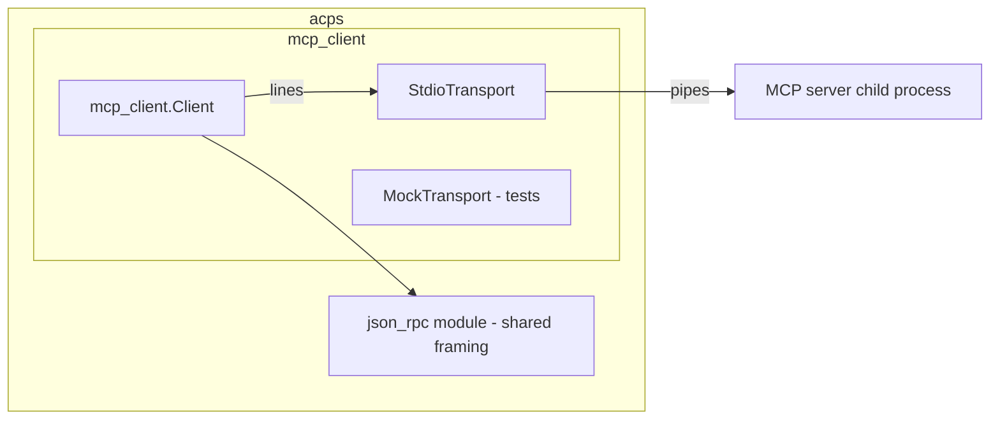

# Architecture

System architecture decisions and rationale. Updated whenever a decision is revisited.

*(Initial skeleton — architecture will be written during the project overview / first planning stage, referencing the ACP spec and OpenAI API docs in `references/`.)*

## Planned Shape (from setup)

```
                 ┌──────────────────────────┐
                 │       ACP Client          │
                 │   (agent host / editor)   │
                 └────────────┬─────────────┘
                              │ JSON-RPC 2.0 over stdio
                 ┌────────────▼─────────────┐
                 │      src/main.zig         │  transport loop: parse stdin → dispatch → write stdout
                 │      protocol/            │  ACP v1 types + method handlers (initialize, session/*, prompt/*, tool/*)
                 │      provider/            │  provider adapters (OpenAI Responses first)
                 └────────────┬─────────────┘
                              │ HTTPS
                 ┌────────────▼─────────────┐
                 │      OpenAI API           │  /v1/responses (streaming, tool calling)
                 └──────────────────────────┘
```

## MVP scope (confirmed 2025-08-10)

Usable-for-basic-use ACP v1 server, OpenAI Responses API only, no config file, minimal env vars (`OPENAI_API_KEY`). Deployed locally first; cross-platform + GitHub Actions release builds later. The first feature (planning stage) defines the exact MVP method set — likely: `initialize`, `session/new`, `session/prompt` (+ streaming `session/update`), minimal `tool/call` support for client-provided tools.

Key principles:
- **Protocol/transport separated from provider** — `protocol/` knows ACP and JSON-RPC; `provider/` knows HTTP APIs; `src/main.zig` wires them together.
- **Stdlib-only** — `std.json`, `std.http.Client`, `std.io`; no third-party Zig deps until a real need appears.
- **Stateless core + explicit state** — sessions stored in memory (prototype phase); persistence is a later decision.
- **Version-aware protocol layer** — ACP v1 primary, v2-ready. `InitializeRequest.protocolVersion` (uint16) selects a versioned method registry at the handshake; JSON-RPC framing and the session/prompt core are shared across versions. Non-breaking additions ride on capabilities negotiation.
- **Session-oriented model** — ACP v1/v2 schemas are session-based (`session/new` → `session/prompt` → `session/update` stream → `PromptResponse`); there are no Thread/Turn types.

---

## Current State (2025-08-11 — session handoff)

**Status:** all work committed on `main`; 56/56 tests, fmt clean, cross-compiles.
Epic 1 (MVP) + Epic 2 (multi-provider) complete. Epic 3 current (see
`.ai/backlog/3.md` — deferred items: per-session multi-LLM, ACP v2,
persistence, Chat Completions adapter).

### Runtime architecture (implemented)

```mermaid
flowchart LR
    C[ACP client] -- stdio JSON-RPC 2.0 --> M[main.zig loop]
    M --> R[protocol/v1 registry: initialize, session/new, set_config_option, session/prompt, session/cancel]
    R --> W[PromptWorker thread]
    W --> A[adapter per ApiKind: openai Responses | anthropic Messages]
    A -- HTTPS --> P[provider API]
    M <-- permission slot --> W   # session/request_permission response routing
```

### MCP client module (feature/mcp-client-module, 2025-08-11)



- **`src/mcp_client/`** — generic MCP **client** (protocol-agnostic; MCP is
  independent of ACP except for shared JSON-RPC 2.0 framing). Exposed as the
  `mcp_client` Zig module (its own `b.addModule`), so it is consumable
  standalone and extractable to a separate package later.
- **Module dependency**: `mcp_client` imports the JSON-RPC framing via a
  declared module import (`json_rpc` module) — not a relative path — the seam
  a future standalone package would use.
- **Transport vtable** (`writeLine`/`readLine`/`deinit`): `StdioTransport`
  spawns the MCP server (`std.process.spawn`, piped stdin/stdout) and speaks
  newline-delimited JSON-RPC; `MockTransport` (test-only, mirrors
  `util/mock_http.zig`) scripts responses for transcript tests.
- **Client methods**: `initialize` (negotiates protocol version, sends
  `notifications/initialized`), `tools/list`, `tools/call`, `resources/list`,
  `resources/read`, `prompts/list`, `prompts/get`, `ping`. Results are copied
  into the caller's allocator; negotiated state lives in the client arena;
  `last_error` records the server's error object after a failed request.
- **ACP integration** (`src/mcp_bridge.zig`): `connectAll` spawns + initializes
  each configured server (argv = command+args; child env = parent clone +
  overrides), per-server failures warn + skip; `buildToolSurface` merges MCP
  tools into the model's tool surface as `"<server>:<tool>"` (parameters =
  MCP inputSchema JSON text; `Tool.ctx` → per-tool `Dispatch`); `mcpExecute`
  routes `tools/call` and joins text content blocks. The existing ACP tool
  flow (report → `session/request_permission` → execute → result) is reused
  unchanged — `runToolCall` looks up the merged surface.
- **Module sharing**: a Zig source file cannot live in two modules —
  `protocol/json_rpc.zig` is now a shared `json_rpc` module dependency
  (imported by both `acps` and `mcp_client`), with its own test target.
- **Gotchas hit**: `Io.Mutex` is an extern struct — init with `Io.Mutex.init`
  (not `.{}`); `lock(io)` is cancelable — use `lockUncancelable`;
  `Io.File.Writer` is buffered — flush after each line or the child never
  receives it; `std.process.Child.kill` blocks until termination and reaps
  (id → null) — do NOT call `wait` after `kill`;
  `std.ArrayList(T)` uses `= .empty` + `append(allocator, …)` in 0.16;
  unmanaged ArrayList `appendSlice`/`append` take the allocator first.

- **Config** (`config.zig`): JSON provider registry (ACP_CONFIG /
  ~/.config/acps/config.json) or env fallback. Each provider:
  `{api, url, api_key|api_key_env, model}`. `model` is the fallback; the
  session overrides it (or any API knob) via `session/set_config_option`
  (arbitrary KVs forwarded to the provider request).
- **Worker model**: `session/prompt` spawns a worker thread (own arena, deep
  copies); the main loop stays live reading stdin → preemptive
  `session/cancel` via an atomic flag polled between chunks. Writer access is
  mutex-guarded. EOF joins/cancels the worker (`worker_done` flag; first-chunk
  guard avoids the startup-cancel race).
- **Permission** (`PendingPermission`): single slot, armed synchronously in
  `sessionPrompt` before spawn (integer ids — the fossil client mangles string
  ids). The main loop routes inbound responses by id.
- **Adapters** (`provider/`): openai (Responses API, nested tools) and
  anthropic (Messages API, flat tools, x-api-key). Dispatched by
  `Context.adapters[@intFromEnum(ApiKind)]`. `api: "anthropic"` skips the
  startup health check (no models endpoint).
- **Logging** (`util/log.zig`): std.log scopes at the edges — `transport`
  (stdio in/out lines), `http` (one line per request/response:
  `{url} {method} body=…` / `{url} {status} body=…`), `provider` (SSE lines).
  Runtime level via `ACP_LOG` (err|warn|info|debug); binary only (tests use
  Zig defaults).

### Zig 0.16 gotchas learned (all hit during development)

- **Never return a struct by value that contains self-referential pointers.**
  `util/http.zig` `Response` must be heap-allocated: the body `reader` borrows
  the struct's own `transfer_buffer` and the request's internals — a copy
  dangles (mock tests passed by luck; the real e2e crashed).
- **The std HTTP client reads header values lazily** — the Authorization
  bearer value must outlive `request()` (arena-owned; the pre-refactor
  `defer free` corrupted it).
- **`error.DeferredResponse` fires errdefers** — returning it from
  `sessionPrompt` freed the worker arena while the worker ran (GP crash).
  Ownership must transfer explicitly.
- **`std.json` union field access is non-optional** in 0.16 — use `switch`.
  Anonymous `.{ .object = obj }` literals are inferred as structs — annotate
  `std.json.Value{...}`.
- **Multiline string literals omit the final newline**; `///` comments are
  invalid inside function bodies.
- **`std.Thread.Mutex` / `std.Thread.sleep` / `std.posix.nanosleep` /
  `std.posix.getenv` / `std.fs.cwd` / `std.time.timestamp` are gone or
  renamed** — see glossary for the replacements (`Io.Mutex`, `Io.Clock`,
  `Io.Dir`, `std.os.linux.*`, `Environ`).
- **DeepSeek specifics**: flat (non-nested) tool shape; must echo the model's
  previous output items (reasoning_text) to continue after tools; model is
  required with no fallback (invalid → clear error); `reasoning.effort`
  optional (omit → model decides); `deepseek-v4-pro` unavailable (2025-08-11).

### Live testing

- e2e with the real fossil client: `tests/fossil-e2e.tcl`
  (`source fossil-agent.tcl` path is hardcoded to
  `~/Downloads/fossil-linux-x64-2.28/`). Set `ACP_CONFIG` (the config file
  is required — the server has no env fallback for provider settings) then
  `tclsh tests/fossil-e2e.tcl`.
- Example provider config: `examples/config.example.json`.
- Smoke: pipe JSON-RPC lines into `zig-out/bin/acps` with
  `ACP_CONFIG` + `ACP_LOG=debug` to trace the whole edge chain.

## Future directions (reviewed 2025-08-11 — not implemented)

- **Single-provider env config** — ACP v1 binds one provider per executable
  (no provider surface in the pinned v1/v2-alpha schemas; `providers/*` +
  `Partner` are UNSTABLE). Candidate: `ACPS_API` / `ACPS_API_URL` /
  `ACPS_API_KEY` envs replace the config-file provider section (env also
  works when embedded); model required per session + optional `effort`.
- **Fork-per-channel** — for a daemon/TCP front-end: fork a child per ACP
  client channel, provider selected via env at fork time (isolation + per-
  client provider). Enabled by the env-config design (fork-friendly); stdio
  ACP today already gives each client its own process. Captured in the
  backlog as a candidate.
